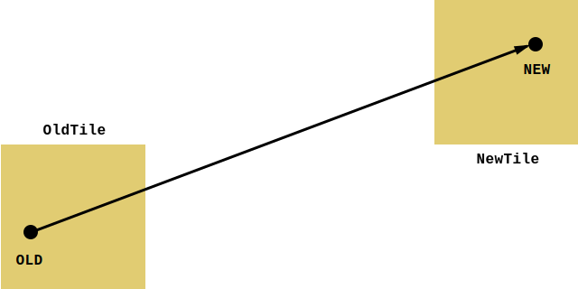
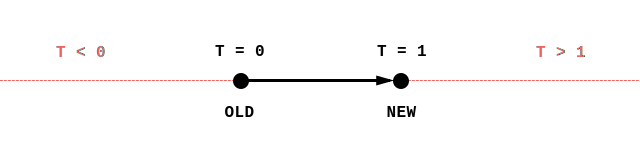
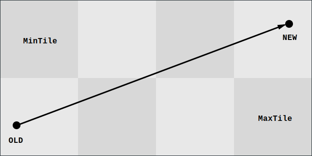
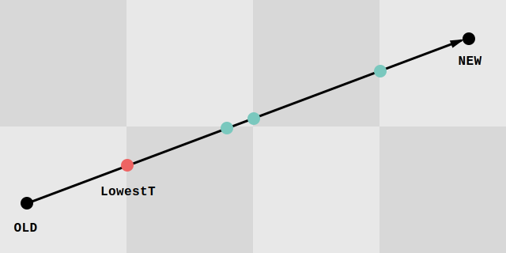

# Collision detection

Please note that all examples are written in pseudo code, trying to stay true to Casey's conventions. I have also removed additional code that deals with limitations of floats. I have changed the code that is specific to C, as I don't want to explain how C works. For further details on that, please refer to the Casey's original videos and code.

This article describes several methods (from simplest to "Casey") so you can choose the best one that works for you in the current development phase / game style.

## Simplest method

A simplest method, really useful just for quick prototyping. The idea is to test whether new position will end in a wall. If it does, we simply won't move player to that new position and keep him where he is.

```C
NewX = EntityX + HorizontalSpeed
NewY = EntityY + VerticalSpeed
if (!IsWallAt(NewX, NewY)) {
    EntityX = NewX
    EntityY = NewY
}
```

Similar method has been implemented in [Day 29](http://youtu.be/EwhVulgF16g).

## Pixel iteration method

This method builds on the previous one. It adds a small loop that slaps the entity against the wall in case we would end up in it. It simply moves the entity in tiny steps (usually in pixels) until the entity hits the wall.

```C
// Check if we would collide with the wall.
if (IsWallAt(EntityX, EntityY + VerticalSpeed))
{
    // Move entity in small steps towards the wall until we reach the wall.
    if (VerticalSpeed > 0) {
        Step = 1
    } else {
        Step = -1
    }
    while (!IsWallAt(EntityX, EntityY + Step)) {
        EntityY += Step
    }
}

if (IsWallAt(EntityX + HorizontalSpeed, EntityY))
{
    if (HorizontalSpeed > 0) {
        Step = 1
    } else {
        Step = -1
    }
    while (!IsWallAt(EntityX + Step, EntityY)) {
        EntityX += Step
    }
}
```

Although this is quite simple, it has several problems. The most obvious is that if the speed is larger than a wall, we might walk right through it.

--TODO-- Do we need to discuss more problems of this method?

--TODO-- There has been an older version of the tile-based collision detection (possibly at Day 43?) before Casey introduced the Line segment method.


<!--

    *************************************************************************
    *************************************************************************
    *************************************************************************
    *************************************************************************
    *************************************************************************

-->


## Line segment method

The previous method is using iteration to find the intersection. This method is also trying to find an intersection, but instead of using iteration, we're going to calculate it.

- **Watch** [Day 47, 21:40](http://youtu.be/5KzJ0TDeLxQ?t=21m40s) for an introduction to intersection math.
- **Watch** [Day 47, 40:35](http://youtu.be/5KzJ0TDeLxQ?t=40m35s) for an introduction to the algorithm.

We know where the entity is (*old position*), and where it ends up (*new position*) by the current *delta*. This gives us a line segment between the *old position* and *new position* end points. I'll refer to this as a *E-segment* on an *E-line*.



For sake of simplicity, we're going to use a tile map to define our collision map by saying which tiles are walls and which are ground. So each wall would be an axis-aligned rectangle.

With a very simple function, we can calculate whether and where the *E-segment* intersects a wall side.

```C
TestWallSideIntersection(
    WallX,
    WallMinY, WallMaxY,
    OldEntityX, OldEntityY,
    EntityDeltaX, EntityDeltaY) {

    // If the entity has not moved in `X` axis, there's no collision
    // to happen, so we go straight to `return 1`.
    if (EntityDeltaX != 0)
    {
        // Calculate `T` which tells us how far the collision happened
        // on `A` axis.
        T = (WallX - OldEntityX) / EntityDeltaX

        // We're only interested in collisions in range of 0 and 1.
        if (T >= 0 && T <= 1)
        {
            // Use T to calculate the actual `B` coordinate of the
            // collision. So now we know that the collision happened
            // at position `[WallX, Y]`.
            Y = OldEntityY + (T * EntityDeltaY)

            // Tests whether the collision actually happened on the
            // line of the wall edge.
            if (Y >= WallMinY && Y <= WallMaxY) {
                return T
            }
        }
    }
    return 1
}
```

With `(WallX - OldEntityX)` we calculate the distance between the *old position* and the wall (on `X` axis) in world units. If we divide that by `EntityDeltaX` we will get a `T` that is relative to the length of the *E-segment*.

`T < 0` means that the intersecion happened on the *E-line* but before the *old position*, `T > 1` means that the intersection happened on the *E-line*, but after the *new position*. Anything between 0 and 1 means that the intersection happened within the *E-segment* and that is what we're interested in. Take a look at this image to better visualize it:



Now we need to deal with the `Y` coordinate. Note that until now, we were considering the wall side to be a line, not a line segment. We use the `T` to calculate `Y` coordinate of the intersection to test whether the intersection happened within the wall side line segment, and if it did, we will return the `T`. Otherwise we will return 1. 1 means that no intersection happened.

Stare on this image for a while to make things clearer:

--TODO-- Image illustrating the various cases in collision detection.

Once we know that the intersection happened within the wall side line segment, we will return the `T`.

Now to put all this to use, we need to check all the sides of all the walls we might have collided with. We won't overthink this, so we will scan through a rectangle that encloses the tile where the *old position* is and the tile where the *new position* is.



We might get a bunch of collisions, but we are only interested in the one, that is closest to the *old position*. To do that, we will remember the lowest `T` returned by the `TestWallIntersection` function.



Now to the pseudo-code:

```C
OldEntityX = Entity.X
OldEntityY = Entity.Y

// Move new entity position by delta.
// This is position where the entity would end up on.
NewEntityX = OldEntityX + EntityDelta.X
NewEntityY = OldEntityY + EntityDelta.Y

// Finally, get the tiles for the old and new position.
OldTile = GetTile(OldEntityX, OldEntityY)
NewTile = GetTile(NewEntityX, NewEntityY)

// Calculate the rectangle.
// `Tile.TileX` and `Tile.TileY` specifies X and Y coordinate of the tile
// in the tile map.
MinTileX = Minimum(OldTile.TileX, NewTile.TileX)
MinTileY = Minimum(OldTile.TileY, NewTile.TileY)
MaxTileX = Maximum(OldTile.TileX, NewTile.TileX)
MaxTileY = Maximum(OldTile.TileY, NewTile.TileY)

// After the loop, we will have the closest intersection distance here.
real ClosestT = 1
for (Y = MinTileY; Y < MaxTileY; Y++) {
    for (X = MinTileX; X < MaxTileX; X++) {
        // Get the tile at X, Y from the TileMap.
        Tile = GetTile(TileMap, X, Y)
        if (Tile.IsWall)
        {
            // `Tile.MinX, MaxX, MinY, MaxY` is a rectangle that specifies
            // world coordinates of the tile.

            // Left side
            T = TestWallSideIntersection(
                    Tile.MinX, Tile.MinY, Tile.MaxY,
                    OldEntityX, OldEntityY, EntityDeltaX, EntityDeltaY)

            if (T < ClosestT) {
                ClosestT = T;
            }

            // Right side
            T = TestWallSideIntersection(
                    Tile.MaxX, Tile.MinY, Tile.MaxY,
                    OldEntityX, OldEntityY, EntityDeltaX, EntityDeltaY)

            if (T < ClosestT) {
                ClosestT = T;
            }

            // Top side
            T = TestWallSideIntersection(
                    Tile.MinY, Tile.MinX, Tile.MaxX,
                    OldEntityY, OldEntityX, EntityDeltaY, EntityDeltaX)

            if (T < ClosestT) {
                ClosestT = T;
            }

            // Bottom side
            T = TestWallSideIntersection(
                    Tile.MaxY, Tile.MinX, Tile.MaxX,
                    OldEntityY, OldEntityX, EntityDeltaY, EntityDeltaX)

            if (T < ClosestT) {
                ClosestT = T;
            }
        }
    }
}

NewEntityX = OldEntityX + (ClosestT * EntityDeltaX)
NewEntityY = OldEntityY + (ClosestT * EntityDeltaY)
```

On the last line, we will calculate the final position of the entity. We are doing the same trick as we did for calculating the `Y` in the `TestWallSideIntersection`.

Note that if no collision happened, the `ClosestT` will be equal to 1. That also means, that we will move the full distance determined by the `EntityDeltaX` and `EntityDeltaY`. If there is a collision, the `ClosestT` will be lower than 1, therefore we won't only move a partial distance; the distance required to get to the wall.

**Watch** [Day 48](http://youtu.be/rWpZLvbT02o) for final version of the algorithm.

The main problem of this method is that it's dealing with thin boundaries. Even a smallest imperfection might lead to glitching through the wall edges. This is especially problematic with floating point types pecularities are being used. This is further discussed by Casey in the Day 48:

- At [23:05](http://youtu.be/5KzJ0TDeLxQ?t=23m05s) for details on some problems that float (or even double) types might lead to.
- At [25:30](http://youtu.be/5KzJ0TDeLxQ?t=25m30s) Casey adds an hot fix (`tEpsilon`) that forces the collision system to put the entity slightly before the wall, to avoid glitching.
- At [33:58](http://youtu.be/5KzJ0TDeLxQ?t=33m58s) Casey shows how an entity can glitch through the walls and later explains why that happens.

<!-- TODO(cohen): Add the tEpsilon hack? It was pretty important in my own implementation... -->


<!--

    *************************************************************************
    *************************************************************************
    *************************************************************************
    *************************************************************************
    *************************************************************************

-->


## Basic Minkowski-based method

To fix the flaws of the line segment method, we need to make the collision detection take the entity's size into account.

**Watch** [Day 50, 6:43](http://youtu.be/_g8DLrNyVsQ?t=6m43s) for the introduction.

<!--TODO Illustration https://www.dropbox.com/s/v9lta3gxrrivqzj/Screenshot%202015-02-23%2004.41.18.png?dl=0 -->

The way we're gonna do that is that we will keep the line intersection as it was (only dealing with points and lines), but we will make the tiles larger. We will basically just add the size of the entity to the size of the tile just before we do our 4 calls to `TestWallSideIntersection`.

As a side note: this trick is based on operation called [Minkowski sum](http://en.wikipedia.org/wiki/Minkowski_addition). Casey talks about it in [Day 50, 5:39](http://youtu.be/_g8DLrNyVsQ?t=5m39s). We will get to *Minkowski sum* later.

First, we need to do is to enlarge the search rectangle by the size of the entity in tile units, then we need to enlarge the tiles by the size of the entity in world units.

```C
// Calculate size of the entity in tiles, rounded up to entire tiles.
EntityTileWidth  = Ceil(Entity.Width / TileMap.TileWidth)
EntityTileHeight = Ceil(Entity.Height / TileMap.TileHeight)

MinTileX = Minimum(OldTile.TileX, NewTile.TileX) - EntityTileWidth
MinTileY = Minimum(OldTile.TileY, NewTile.TileY) - EntityTileHeight
MaxTileX = Maximum(OldTile.TileX, NewTile.TileX) + EntityTileWidth
MaxTileY = Maximum(OldTile.TileY, NewTile.TileY) + EntityTileHeight

ClosesT = 1
for (Y = MinTileY; Y <= MaxTileY; Y++) {
    for (X = MinTileX; X <= MaxTileX; X++) {
        Tile = GetTile(X, Y)
        if (Tile.IsWall) {

            LargerTileMinX = Tile.MinX - (Entity.Width  / 2)
            LargerTileMinY = Tile.MinY - (Entity.Height / 2)
            LargerTileMaxX = Tile.MaxX + (Entity.Width  / 2)
            LargerTileMaxY = Tile.MaxY + (Entity.Height / 2)

            // Left edge
            T = TestWallSideIntersection(
                LargerTileMinX, LargerTileMinY, LargerTileMaxY,
                OldEntityX, OldEntityY, EntityDeltaX, EntityDeltaY)

            if (T < ClosesT) {
                ClosesT = T;
            }

            // Right edge
            T = TestWallSideIntersection(
                LargerTileMaxX, LargerTileMinY, LargerTileMaxY,
                OldEntityX, OldEntityY, EntityDeltaX, EntityDeltaY)

            if (T < ClosesT) {
                ClosesT = T;
            }

            // Top edge
            T = TestWallSideIntersection(
                LargerTileMinY, LargerTileMinX, LargerTileMaxX,
                OldEntityY, OldEntityX, EntityDeltaY, EntityDeltaX)

            if (T < ClosesT) {
                ClosesT = T;
            }

            // Bottom edge
            T = TestWallSideIntersection(
                LargerTileMaxY, LargerTileMinX, LargerTileMaxX,
                OldEntityY, OldEntityX, EntityDeltaY, EntityDeltaX)

            if (T < ClosesT) {
                ClosesT = T;
            }
        }
    }
}

NewEntityX = OldEntityX + (ClosestT * EntityDeltaX)
NewEntityY = OldEntityY + (ClosestT * EntityDeltaY)
```

**Watch** [Day 50, 22:26](http://youtu.be/_g8DLrNyVsQ?t=22m26s) to see how Casey implements it (in a slightly different order)

<!--

    *************************************************************************
    *************************************************************************
    *************************************************************************
    *************************************************************************
    *************************************************************************

-->

## Gliding

-- TODO --

<!--
    Gliding for Minkowski:
    (Day 50) http://youtu.be/_g8DLrNyVsQ?t=44m12s

    Gliding in older collision detection
    (Day 46) https://www.youtube.com/watch?v=BU5xBpUMdPA
-->


<!--

    *************************************************************************
    *************************************************************************
    *************************************************************************
    *************************************************************************
    *************************************************************************

-->

## Gilber-Johnson-Keerthi (GJK)

[GJK](http://en.wikipedia.org/wiki/Gilbert%E2%80%93Johnson%E2%80%93Keerthi_distance_algorithm) requires a bit of thinking to understand, though it is still very simple to implement.

--TODO--

<!--

    *************************************************************************
    *************************************************************************
    *************************************************************************
    *************************************************************************
    *************************************************************************

-->

<!--
    51 - Casey commented the entire collision code.
    After day 50, there seems to be more bugs in the code: https://forums.handmadehero.org/index.php/forum?view=topic&catid=4&id=346
-->


<!--
    - We are going to use the code from the line segment method and build on top of it.
    - Day 50, 26:00  Casey changes the line segment algorithm to minkowski-based.
    - Around 35, Casey changes the height of the player.
    - TODO: Explain why we need Minkowski sum and how we will use it.
-->

<!--
**Watch** [Day 50, 5:39](http://youtu.be/_g8DLrNyVsQ?t=5m39s) for introduction to [Minkowski sum](http://en.wikipedia.org/wiki/Minkowski_addition) and difference.

*Minkowski sum* is an operation in which you add every point of shape A to every point of shape B.

The result looks like taking the shape A and sweeping it along the outline of shape B. Consider how *Minkowski sum* of circle + square looks like:

--TODO--

*Minkowski sum* of a triangle and a square:

--TODO--

*Minkowski sum* of a square and square:

--TODO--

A universal version of *Minkowski sum* in code:

```C
function MikowskiSum(A[], B[]) {
    Sum = []
    for each PointA in A {
        for each PointB in B {
            Sum.AddPoint(PointB.X + PointA.X, PointB.Y + PointA.Y)
        }
    }
}
```

For our basic version of collision detection, we will use a simplified version of *Minkowski sum*. We only need the outer points, and we will only work with rectangles. So a sum of `RectangleA` a `RectangleB` will result in another rectangle `RectangleSum` that can be calculated like this:

```C
RectangleSum.Width  = RectangleA.Width  + RectangleB.Width
RectangleSum.Height = RectangleA.Height + RectangleB.Height
// ? RectangleSum.Origin = RectangleA.Origin + RectangleB.Origin
```

- Expand the search rectangle by the size of the entity.
- Expand each Tile.Rect by the size of the entity.

-->